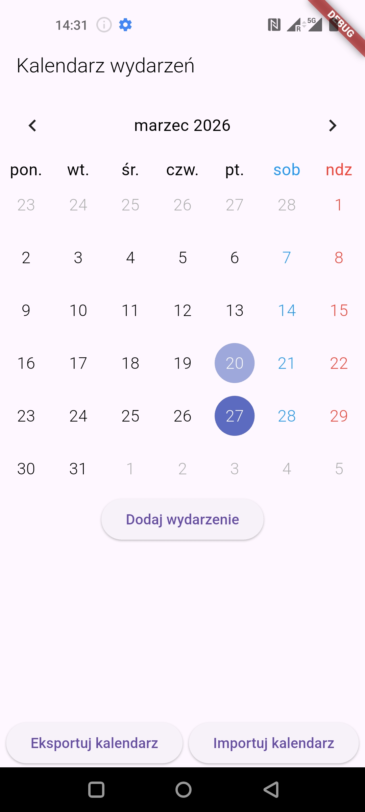
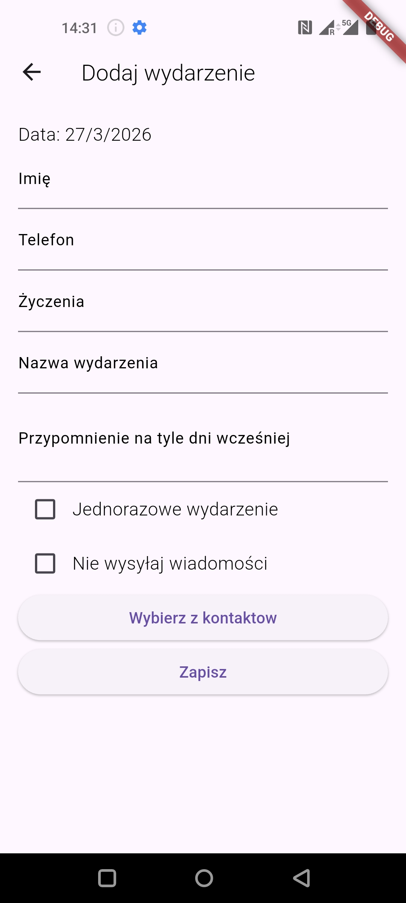
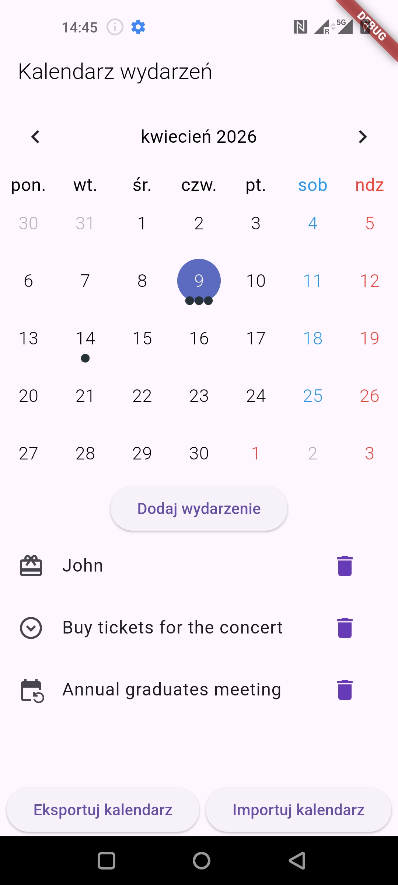

# urodziny_app

Simple application written in Flutter / Dart that reminds about birthdays and other events and  automatically proposes prepared WhatsApp message to be sent.

## Reason for creating this app

This application was written as a hobby project. As an embedded developer with no experience in mobile applications development this project served as a learning opportunity and it was the first time I touched Flutter and Dart. I didn't use AI while working on this application. I don't have anything against AI tools, but when it comes to learning, I prefer to do it the oldschool way.

## About the app

This application allows the user to add birthday events to the calendar and select a person from the contact list. The name and the phone number will be added to the event and the user can write the birthday wishes. On the day of that birthday, user will receive a notification. After clicking the notification WhatsApp conversation with this person will open and the wishes will be automatically pasted to the message field. User can still modify the wishes before they decide to send them.
There application allows also:
* Editing and deleting the events
* Not sending the message - notification reminds about the event but clicking it doesn't do anything
* Creating one time event
* Adding a reminder before the event - there will be an additional notification before the actual event (date of this notification can be chosen by the user)
* Exporting and importing the calendar to and from a file

This app is working fully locally so there is no backend that stores the events and manages the notifications. That's why exporting and importing happens using a native filesystem.

Main flutter packages used in this project:
* table_calendar
* local_notifications
* permission_handler
* hive
* url_launcher

## Screenshots

